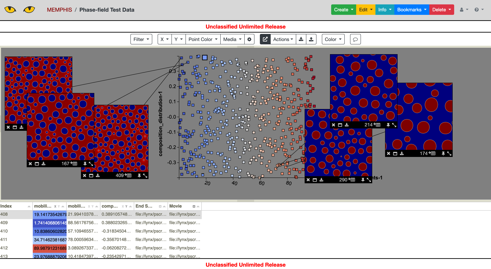
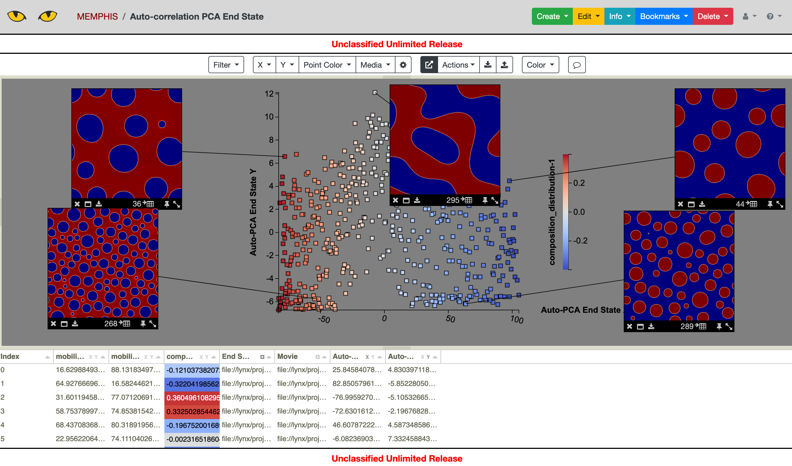
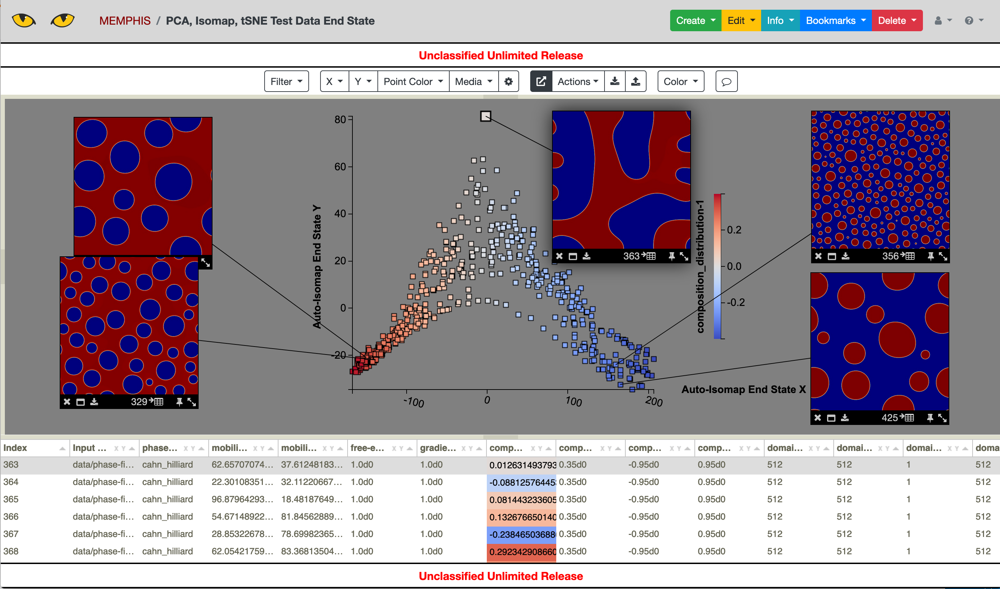
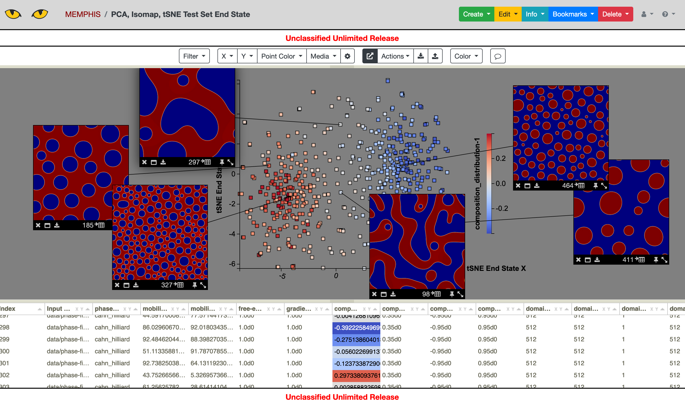
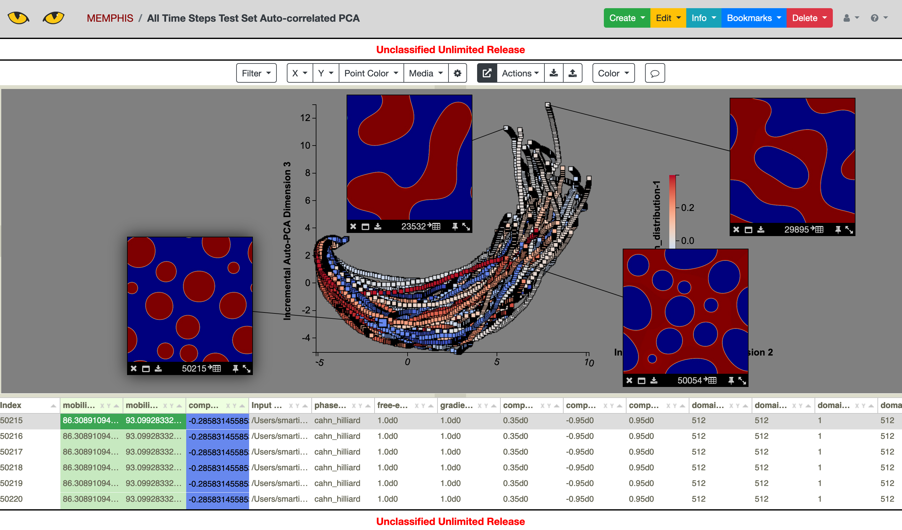
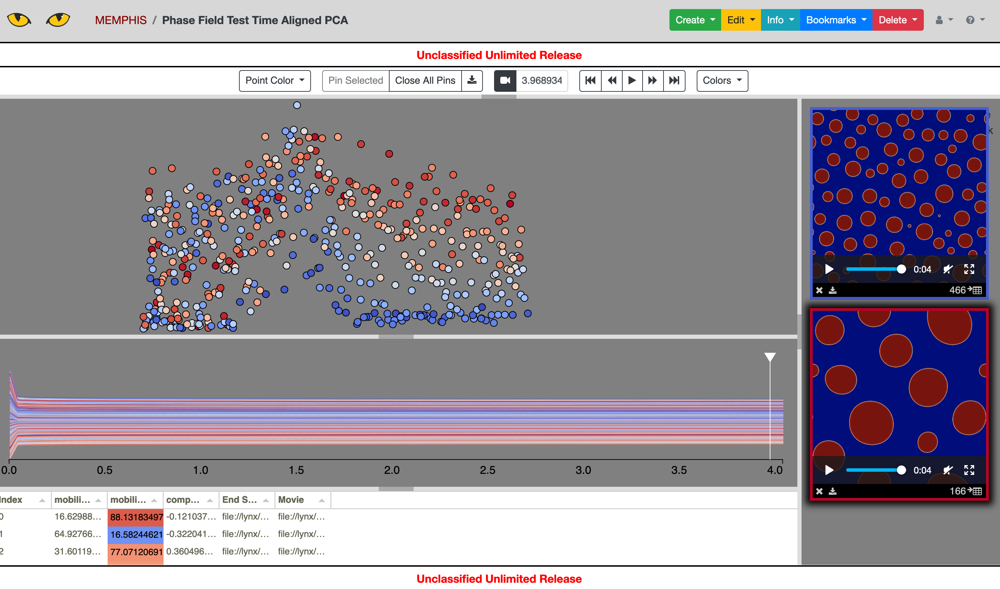
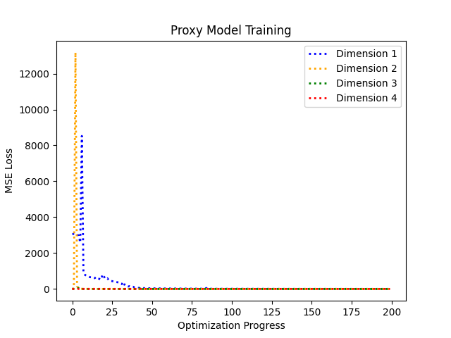
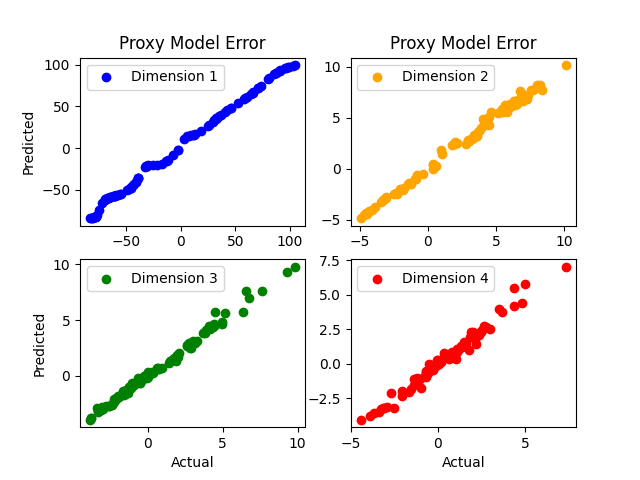
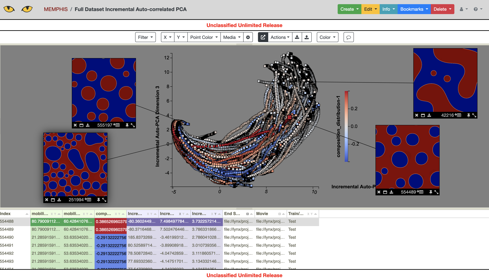

.. 
   Copyright (c) 2021 National Technology and Engineering Solutions of Sandia, LLC.  
   Under the terms of Contract DE-NA0003525 with National Technology and Engineering 
   Solutions of Sandia, LLC, the U.S. Government retains certain rights in this software.

.. _example:

Example
=======

Here we provide a step-by-step example using the data from the following paper:

Montes de Oca Zapiain, D., Stewart, J.A. & Dingreville, R. "Accelerating 
phase-field-based microstructure evolution predictions via surrogate models 
trained by machine learning methods." npj Comput Mater 7, 3 (2021). 
https://doi.org/10.1038/s41524-020-00471-8

Test Data
---------

We start with an easier computation using only the test data.  We assume the
test data is in the directory:

.. code-block:: python

    data/phase-field/test_data

Pre-processing
^^^^^^^^^^^^^^

This directory contains ``workdir.1`` to ``workdir.500``, with each of these
directories containing an input deck for MEMPHIS in ``in.cahn_hilliard`` and
outputs from the simulation in ``out.cahn_hilliard_0.vtk`` to 
``out.cahn_hilliard_50000000.vtk``, at intervals with a step size of 500,000.

To create an initial .csv table which includes the metadata for running the
simulations, we use:

.. code-block:: python

    python -m table --create --ensemble data/phase-field/test_data/workdir.%d \
        --output-dir data/phase-field/test_out \
        --input-files in.cahn_hilliard \
        --input-header "Input Deck" \
        --csv-out metadata.csv \
        --over-write \
        --csv-index "Simulation Index"

Next we create movies of each of the simulations using the time steps provided:

.. code-block:: python

    python -m convert --ensemble data/phase-field/test_data/workdir.%d \
        --input-files out.cahn_hilliard_%d.vtk \
        --output-dir data/phase-field/test_out \
        --output-format mp4 \
        --over-write \
        --csv-out movies.csv \
        --csv-header Movie \
        --field-var phase_field \
        --color-scale 0 1

This step creates a mirrored directory structure in our output directory
``data/phase-field/test_out``.  Each of the directories ``workdir.*`` in this
directory will contain a .mp4 file containing the generated videos.  The videos
will have the name ``out.cahn_hilliard_phase_field.mp4`` created by using
the root name ``out.cahn_hilliard_`` and the field variable ``phase_field``
provided in the command line call.

We also want to create images from the end state of the simulations:

.. code-block:: python

    python -m convert --ensemble data/phase-field/test_data/workdir.%d \
        --input-files out.cahn_hilliard_50000000.vtk \
        --output-dir data/phase-field/test_out \
        --output-format jpg \
        --over-write \
        --csv-out end-state.csv \
        --csv-header "End State" \
        --field-var phase_field \
        --color-scale 0 1

This command creates files ``out.cahn_hilliard_50000000.jpg`` in each of the ``workdir.*``
subdirectories of the ``data/phase-field/test_out`` directory.

Now we can create a .csv table with file links to both the movies and the end state images
using (from the output directory):

.. code-block:: python

    python -m table --join \
        data/phase-field/test_out/metadata.csv \
        data/phase-field/test_out/end-state.csv \
        data/phase-field/test_out/movies.csv \
        --output-dir data/phase-field/test_out \
        --csv-out ps.csv \
        --over-write \
        --csv-no-index \
        --ignore-index \
        --csv-headers mobility_coefficients-1 mobility_coefficients-2 composition_distribution-1 "End State" "Movie" \
        --uri-root-out file://memphis/phase-field/test_out \
        --convert-cols "End State" "Movie"

The resulting .csv table includes file pointers to the movies and end state images stored in
the directory ``file://memphis/phase-field/test_out``.  Assuming the
permissions are set correctly for these files, the table ``ps.csv`` can be imported
into Slycat as a Parameter Space model.  The Slycat visualization is shown below.

Dimension Reduction
^^^^^^^^^^^^^^^^^^^

Dimension reduction can be performed using a variety of strategies and algorithms.

Single Time Step
""""""""""""""""

The simplest dimension reduction is performed on a single time step for each simulation.
For example:

.. code-block:: python

    python -m reduce --ensemble data/phase-field/test_data/workdir.%d \
        --input-files out.cahn_hilliard_50000000.vtk \
        --output-dir data/phase-field/test_out \
        --output-file out.cahn_hilliard_PCA.rd.npy \
        --algorithm PCA \
        --num-dim 2 \
        --over-write \
        --field-var phase_field \
        --auto-correlate --binary \
        --xy-out auto-PCA-end-state.csv \
        --xy-header "Auto-PCA End State"

This command produces a file ``auto-PCA-end-state.csv`` which contains the (x,y) coordinates.
This file can be joined into a .csv table that can be imported into Slycat, using (from the
output directory):

.. code-block:: python

    python -m table --join \
        data/phase-field/test_out/metadata.csv \
        data/phase-field/test_out/end-state.csv \
        data/phase-field/test_out/movies.csv \
        data/phase-field/test_out/auto-PCA-end-state.csv \
        --output-dir data/phase-field/test_out \
        --csv-out ps-PCA.csv \
        --over-write \
        --csv-no-index \
        --ignore-index \
        --uri-root-out file://memphis/phase-field/test_out \
        --convert-cols "End State" "Movie"
        
The resulting file ``ps-PCA.csv`` can be imported into Slycat as a parameter space model.
The PCA coordinates can be plotted and the points colored according to composition distribution
as shown below.

This can be repeated using different dimension reduction algorithms, for example using
Isomap:

.. code-block:: python

    python -m reduce --ensemble data/phase-field/test_data/workdir.%d \
        --input-files out.cahn_hilliard_50000000.vtk \
        --output-dir data/phase-field/test_out \
        --output-file out.cahn_hilliard_Isomap.rd.npy \
         --algorithm Isomap \
         --num-dim 2 \
         --over-write \
         --field-var phase_field \
         --auto-correlate --binary \
         --xy-out auto-Isomap-end-state.csv \
         --xy-header "Auto-Isomap End State"

Or tSNE:

.. code-block:: python

    python -m reduce --ensemble data/phase-field/test_data/workdir.%d \
        --input-files out.cahn_hilliard_50000000.vtk \
        --output-dir data/phase-field/test_out \
        --output-file out.cahn_hilliard_auto_PCA.rd.npy \
        --algorithm PCA \
        --over-write \
        --field-var phase_field \
        --auto-correlate --binary \
        --num-dim 30

    python -m reduce --ensemble data/phase-field/test_out/workdir.%d \
        --input-files out.cahn_hilliard_auto_PCA.rd.npy \
        --output-dir data/phase-field/test_out \
        --output-file out.cahn_hilliard_tSNE.rd.npy \
        --algorithm tSNE \
        --num-dim 2 \
        --over-write \
        --xy-out auto-tSNE-end-state.csv \
        --xy-header "Auto-tSNE End State"

The first step uses auto-correlation and PCA to reduce the dataset to 30 dimensions.  The 
second step does tSNE.

Many of these algorithms lack several features that are necessary to complete
the entire simulation acceleration pipeline.  For example, Isomap and PCA operate only 
in-memory so that they cannot process extremely large datasets, e.g. a full ensemble.  
In addition, some of the algorithms cannot project a new data point into the reduced space 
after the fact.  Most of them also cannot reconstruct a data point from the reduced space 
into the full space.  Pre-processing, e.g. using auto-correlation, can also prevent
reconstruction.

Nevertheless, the algorithms and pre-processing steps can be used to analyze intermediate 
results to better visualize/understand the ensemble.

All Time Steps
""""""""""""""

Of course, the dimension reduction algorithms can also be applied to the entire dataset,
not just the end state, depending on how well the algorithm scales to large datasets.  Since
simulations generate massive amounts of data, algorithms such as Isomap and tSNE may not perform
well enough to provide results for the entire dataset.

However, incremental and landmark versions of the algorithms are available, and these
algorithms are also supported by the romans dimension reduction utility.  A basic incremental
algorithm is incremental PCA, which can be used as follows.

.. code-block:: python

    python -m reduce --ensemble data/phase-field/test_data/workdir.%d \
        --input-files out.cahn_hilliard_%d.vtk \
        --output-dir data/phase-field/test_out \
        --output-file out.cahn_hilliard_inc_auto_PCA_10.rd.npy \
        --algorithm incremental-PCA \
        --field-var phase_field \
        --auto-correlate --binary \
        --over-write \
        --csv-out incremental-auto-PCA.csv \
        --csv-header "Incremental Auto-PCA" \
        --output-model inc-auto-PCA.pkl \
        --num-dim 10 \
        --file-batch-size 1000

To use Slycat to visualize the results, use:

.. code-block:: python

    python -m table --join \
        data/phase-field/test_out/metadata.csv \
        data/phase-field/test_out/end-state.csv \
        data/phase-field/test_out/movies.csv \
        data/phase-field/test_out/incremental-auto-PCA.csv \
        --output-dir data/phase-field/test_out \
        --csv-out metadata-inc-auto-PCA.csv \
        --over-write \
        --uri-root-out file://memphis/phase-field/test_out \
        --convert-cols "End State" Movie

    python -m table --expand \
        data/phase-field/test_out/metadata-inc-auto-PCA.csv \
        --expand-header "Incremental Auto-PCA" \
        --output-dir data/phase-field/test_out \
        --csv-out ps-inc-auto-PCA.csv \
        --plugin parameter_space \
        --remove-expand-col \
        --include-original-index \
        --num-dim 3 \
        --csv-no-index

Time-Aligned Dimension Reduction
""""""""""""""""""""""""""""""""

The dimension reduction utility includes a time-aligned dimension reduction meta-algorithm
which is ideally suited for numerical simulation output.  The time-aligned algorithm perfoms 
a reduction at each time step then aligns those reductions as a last step using the Kabsch
algorithm.  This provides a natural way to divide the work and also respects the importance
of time in simulation data.  The time-aligned reduction algorithm can be used by throwing the 
``--time-align`` argument, as shown below:

.. code-block:: python

    python -m reduce --ensemble data/phase-field/test_data/workdir.%d \
        --input-files out.cahn_hilliard_%d.vtk \
        --output-dir data/phase-field/test_out \
        --output-file out.cahn_hilliard_time_aligned_PCA.rd.npy \
        --algorithm PCA \
        --time-align 10 \
        --num-dim 2 \
        --auto-correlate --binary \
        --field-var phase_field \
        --over-write \
        --file-batch-size 500 \
        --csv-out time-aligned-PCA.csv \
        --csv-header "Time Aligned PCA"

The results of the time aligned reduction can be used to create a Slycat VideoSwarm model
using:

.. code-block:: python

    python -m table --join \
        data/phase-field/test_out/metadata.csv \
        data/phase-field/test_out/end-state.csv \
        data/phase-field/test_out/movies.csv \
        data/phase-field/test_out/time-aligned-PCA.csv \
        --output-dir data/phase-field/test_out \
        --ignore-index \
        --csv-out metadata-time-aligned-PCA.csv \
        --csv-no-index \
        --over-write \
        --csv-headers mobility_coefficients-1 mobility_coefficients-2 composition_distribution-1 "End State" Movie "Time Aligned PCA" \
        --uri-root-out file://memphis/phase-field/test_out \
        --convert-cols "End State" Movie

    python -m table --expand \
        data/phase-field/test_out/metadata-time-aligned-PCA.csv \
        --expand-header "Time Aligned PCA" \
        --output-dir data/phase-field/test_out/vs-time-aligned \
        --csv-out videoswarm.csv \
        --plugin videoswarm \
        --remove-expand-col \
        --video-fps 25

.. warning::

    Currently VideoSwarm supports only videos written at 25 FPS.

Details on the time-aligned algorithm can be found in the publication:

Martin S., Sielicki, M. A., Gittinger, J., Letter, M., Hunt, W. L., and Crossno, P. J., 
"VideoSwarm: Analyzing Video Ensembles", Visualization and Data Analysis 2019, 
Burlingame, CA, USA, 16-17 January 2019. https://doi.org/10.2352/ISSN.2470-1173.2019.1.VDA-685

Proxy Model Training
^^^^^^^^^^^^^^^^^^^^

Once an appropriate dimension reduction has been performed, a proxy model can be trained
on the simulation output.  In the case of this example, we use auto-correlation followed
by PCA.  To train a proxy model using an LSTM neural network, we use:

.. code-block:: python

    python -m model --ensemble data/phase-field/test_out/workdir.%d[0:401] \
        --input-file out.cahn_hilliard_inc_auto_PCA_10.rd.npy \
        --train %d[20:90] \
        --over-write \
        --output-model LSTM-model.pkl \
        --algorithm LSTM \
        --num-dim 5 \
        --LSTM-steps 10

    python -m model --ensemble data/phase-field/test_out/workdir.%d[401:] \
        --input-file out.cahn_hilliard_inc_auto_PCA_10.rd.npy \
        --output-file LSTM-preds.px.npy \
        --test %d[20:90] 11 \
        --over-write \
        --input-model data/phase-field/test_out/LSTM-model.pkl

The first command trains the model using the first 400 simulations, and the second 
produces predictions using the last 100 simulations.  After a model has been trained, 
the optimization statistics can be plotted, using:

.. code-block:: python

    python -m validate --proxy \
        --ensemble data/phase-field/test_out/workdir.%d[401:] \
        --input-file out.cahn_hilliard_inc_auto_PCA_10.rd.npy \
        --output-file data/phase-field/test_out/LSTM-predictions \
        --input-pred-file LSTM-preds.px.npy \
        --input-model data/phase-field/test_out/LSTM-model.pkl \
        --test %d[10:90] 11

The validate command can also be used to show the variance captured using the dimension
reduction algorithm:

.. code-block:: python

    python -m validate --reduction \
        --input-model data/phase-field/test_out/inc-auto-PCA.pkl \
        --output-file data/phase-field/test_out/pca-model-stats

Full dataset
------------

To use the romans tools on the full phase-field dataset, a super (parallel) computer should 
be used.  The romans tools can be used in parallel with ipyparallel.  Depending on the setup 
of the cluster, the following commands/batch scripts would be used to perform an analysis on
the full phase-field dataset.  The necessary steps are described below.  The source code is
in the ``cluster`` directory of the romans repository.

To perform the incremental auto-correlated PCA reduction used in (de Oca Zapiain, et al.),
the following batch script should first be run on the training set.  The precise form of
the batch script will depend on the cluster.

.. literalinclude:: ../../cluster/inc-auto-PCA/run-inc-PCA-train.sh
  :language: batch

Next, the test set can be reduced by projection using the model learned on the training set.

.. literalinclude:: ../../cluster/inc-auto-PCA/run-inc-PCA-test.sh
  :language: batch

Finally, a Slycat Parameter Space model can be generated using the ``ps-csv.py`` script in
``cluster``.  The code is shown below as an example.

.. literalinclude:: ../../cluster/ps-csv.py
  :language: python

Here is the full dataset reduction.  It is (unsurprisingly) similar to the 
reduction on only the test data.

