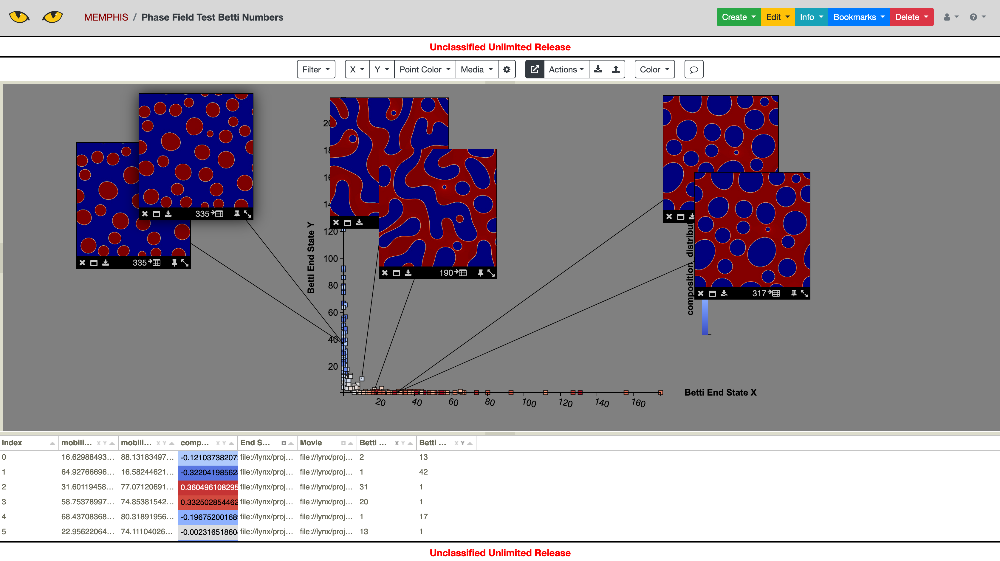

.. 
   Copyright (c) 2021 National Technology and Engineering Solutions of Sandia, LLC.  
   Under the terms of Contract DE-NA0003525 with National Technology and Engineering 
   Solutions of Sandia, LLC, the U.S. Government retains certain rights in this software.

Visualization
=============

The simulation acceleration utilities can be used in conjunction with
the Slycat system for visualization of the results.  Slycat is available
for use on the SRN and SCN at Sandia.  The SRN version of slycat can
be found at https://slycat.sandia.gov.

The romans utilities generate input compatible with Slycat.  Once the input
has been generated, the models can be uploaded using the Slycat wizards.
Slycat mdels currently supported by romans include Parameter Space and
VideoSwarm.  For documentation on Slycat see https://slycat.readthedocs.io/en/latest/.

